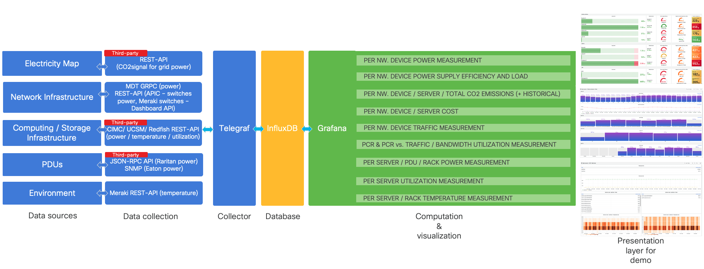

# Green Monitoring Stack

 

## Table of contents

- [Green Monitoring Stack](#green-monitoring-stack)
  - [Table of contents](#table-of-contents)
  - [About the project](#about-the-project)
    - [KPIs](#kpis)
    - [Technology stack](#technology-stack)
  - [Getting started](#getting-started)
    - [Prerequisites](#prerequisites)
    - [Configuration](#configuration)
    - [Installation](#installation)
  - [Usage](#usage)
    - [Access](#access)
    - [Dashboards](#dashboards)
  - [Specifications](#specifications)
  - [FAQ](#faq)
  - [Contributing](#contributing)
  - [License](#license)
  - [Contact](#contact)
  - [Acknowledgements](#acknowledgements)

## About the project

A monitoring stack with samples for collection and data exploration for sustainability purposes.

The data is collected from Network, DC (compute / storage) infrastructure, third-party devices and external sources to be able to understand the **energy consumption** and its relation to traffic and bandwidth, the **cost** and the **carbon footprint** of the environment at various levels of granularity.

### KPIs

| Element | KPI |
| :---------- | :------------ |
| network device | power   power supply load   power supply efficiency     traffic   bandwidth utilization   power consumption ratio (PCR) - [reference](SPECS.md#power-consumption-ratio-pcr)     CO2-eq emissions (+ historical)   cost|
| server | power   utilization   temperature     CO2-eq emissions   cost |
| pdu | power |
| rack | power   _TBD:_ temperature|

### Technology stack

*Architecture*

Captures data from:
- IOS-XR routers
- NX-OS switches
- Meraki switches
- UCS servers
- ACI APIC
- Raritan PDUs
- Eaton PDUs

Stores data in:
- InfluxDB v2

Exposes data in:
- Grafana

Data Flow:

    IOS-XR
    NX-OS
    Meraki
    ACI APIC                   -> Telegraf     ->     InfluxDB     -> Grafana
    UCS: REDFISH/CIMC/UCSM
    Raritan PDUs
    Eaton PDUs

---

## Getting started

### Prerequisites

[Use these instructions](./stack/README.md#prerequisites).

### Configuration
[Use these instructions](./stack/README.md#configuration).

### Installation
[Use these instructions](./stack/README.md#installation).

## Usage

### Access

Access the two following WebUIs by replacing the `HOST_IP` placeholder with the reachable IP address of the host that runs the stack:

- [Grafana](http://HOST_IP:3000) - hosts custom visualizations.
- [Influx](http://HOST_IP:8086) (_credentials based on [.env](./stack/.env)_) - for exploration of raw data.

### Dashboards

Overview power - Meraki - organization/switches

Overview power - DC - Nexus

Overview CO2-eq emissions - DC - Nexus

Overview power - NCS, ASR 9K, Cisco 8K

Overview CO2-eq emissions - NCS, ASR 9K, Cisco 8K

Historical overview of CO2-eq emissions - Fretta

Power - DC - UCS

Temperature - DC - UCS

Utilization - DC - UCS

Rack view - DC - UCS 1/3

Rack view - DC - UCS 2/3

Rack view - DC - UCS 3/3

PDUs - Raritan

PDUs - Eaton

Cost - DC - Nexus and UCS

PCR (Power consumption ratio) versus Traffic

PCR (Power consumption ratio) versus Bandwidth utilization - concept

PCR (Power consumption ratio) versus Bandwidth utilization - NCS

PCR (Power consumption ratio) versus Bandwidth utilization - ASR 9K and Cisco 8K

Bandwidth utilization and distribution per interface

## Specifications

The collections available are documented in [SPECS.md](SPECS.md).

## FAQ

See [FAQ.md](FAQ.md).

## Contributing

Contributions are highly appreciated. Please follow the guidelines documented in [CONTRIBUTING.md](./CONTRIBUTING.md).

## License

Distributed under the **Apache License Version 2.0**. See the [LICENSE](./LICENSE) for more information.

## Contact

Cristina Precup - cprecup@cisco.com

## Acknowledgements

- [Cisco](https://www.cisco.com)
- [CO2 Signal](https://www.co2signal.com)
- [Electricity Maps](https://www.electricitymaps.com)
- [Influx Data](https://www.influxdata.com)
- [Grafana Labs](https://grafana.com)
- [Eaton](https://www.eaton.com)
- [Raritan](https://www.raritan.com)
